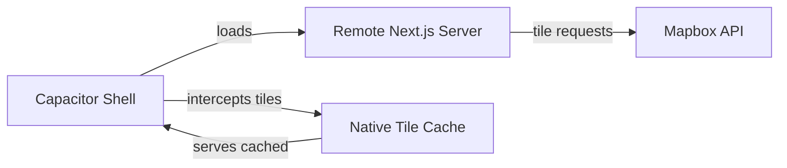
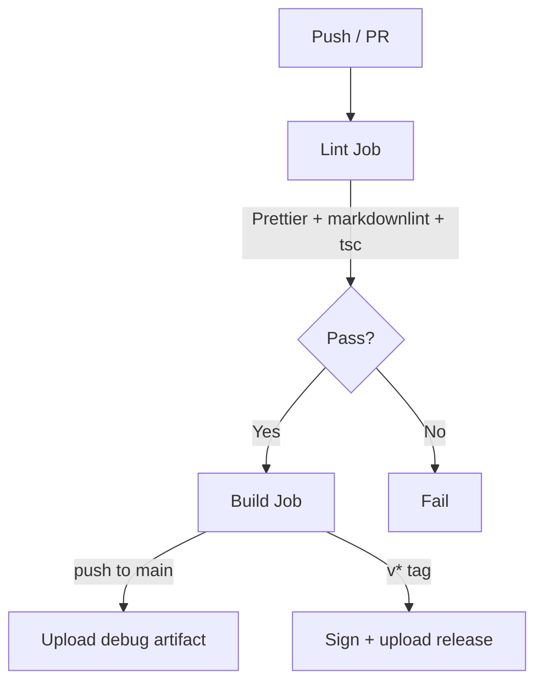

# TrustSky Spotlight -- Mobile App

Capacitor 8 native shell for the TrustSky Spotlight UTM platform.
Loads the web app from a remote server and adds native offline tile
caching for Mapbox maps.

|                 |                                  |
| --------------- | -------------------------------- |
| **App ID**      | `ae.trustsky.spotlight`          |
| **Server**      | `http://20.196.25.174:3000`      |
| **Android min** | SDK 29 (Android 10)              |
| **iOS min**     | 16.0                             |
| **Java**        | JDK 21 (required by Capacitor 8) |
| **Node**        | 22+ (required by Capacitor 8)    |

## Prerequisites

- Node.js 22+
- JDK 21 (`sudo apt install openjdk-21-jdk-headless` on Ubuntu)
- For local Android builds: Android SDK 35+
- For local iOS builds: macOS with Xcode 15+
- Or just Docker (for Android builds -- no JDK or SDK needed)

## Quick Start

```bash
npm install
npx cap sync
```

## Building

### Docker (recommended for Android)

No local JDK or Android SDK required. Just Docker.

```bash
docker compose run android-build      # debug APK  -> ./build-output/app-debug.apk
docker compose run android-release    # release AAB -> ./build-output/app-release.aab
docker compose run android-shell      # interactive shell with full SDK
```

The Dockerfile installs JDK 21, Android SDK 35/36, and Gradle in a
multi-stage build. The `.dockerignore` keeps the context small by
excluding `ios/`, `.git/`, and `node_modules/`.

### Local

```bash
# Android
npx cap sync android
npx cap run android                   # device or emulator

# iOS (macOS only)
npx cap sync ios
npx cap run ios                       # simulator
npx cap open ios                      # open in Xcode
```

### Fastlane

```bash
fastlane android build_dev            # debug APK
fastlane android build_release        # signed release AAB
fastlane ios build_dev                # debug IPA
fastlane ios build_release            # signed release IPA
```

## Formatting and Linting

| Tool                   | Scope                     | Config file          |
| ---------------------- | ------------------------- | -------------------- |
| **Prettier**           | TS, MD, YAML, JSON, HTML  | `.prettierrc`        |
| **markdownlint**       | Markdown files            | `.markdownlint.json` |
| **TypeScript** (`tsc`) | Type checking             | `tsconfig.json`      |
| **google-java-format** | Java plugin code          | (Google style)       |
| **EditorConfig**       | Indent/whitespace for all | `.editorconfig`      |

```bash
npm run fmt                           # format TS, MD, YAML, JSON, HTML
npm run fmt:check                     # check without writing
npm run lint:md                       # markdownlint
npm run lint:ts                       # tsc --noEmit
```

Java formatting (requires
[google-java-format](https://github.com/google/google-java-format)):

```bash
google-java-format --replace android/app/src/main/java/ae/trustsky/spotlight/**/*.java
```

## Architecture

The app does **not** bundle the web app. It loads from the remote
server, with `www/index.html` as an offline fallback when the server
is unreachable.



### Offline Tile Caching

Map tiles are cached natively for offline use. The two platforms use
different interception strategies:

**Android** -- `shouldInterceptRequest` on `BridgeWebViewClient`
transparently intercepts HTTPS tile requests. No web app changes
needed.

**iOS** -- WKWebView cannot intercept HTTPS. A custom
`WKURLSchemeHandler` handles a `cachedtile://` URL scheme. The web
app rewrites tile URLs via `transformRequest` when running on iOS
Capacitor.

Cached tile sources: vector basemap, satellite raster, terrain DEM,
style JSON, glyphs, sprites.

Default offline region: UAE bounding box `[51, 22, 57, 26]`,
zoom 5--12.

### Web App Changes

Two changes were made in the `trustsky-spotlight` repo to support
the mobile shell:

1. **`src/hooks/useMapbox.ts`** -- `transformRequest` rewrites tile
   URLs to `cachedtile://` on iOS Capacitor. No-op on web/Android.
2. **`src/lib/auth.ts`** -- Cookie `sameSite` is configurable via
   `COOKIE_SAME_SITE` env var (default: `strict`). Set to `lax`
   for Capacitor WebView OAuth flows.

## Project Structure

```text
spotlight-app/
  capacitor.config.ts            # server URL, plugins
  Dockerfile                     # Android build (JDK 21 + SDK 35)
  docker-compose.yml             # one-command builds
  .editorconfig                  # indent/whitespace rules
  .prettierrc                    # Prettier config
  .markdownlint.json             # markdownlint config
  src/
    config.ts                    # tile URL patterns, UAE bbox
    plugins/
      definitions.ts             # OfflineTilesPlugin TS interface
      OfflineTilesPlugin.ts      # Capacitor plugin bridge
      web.ts                     # no-op web fallback
  android/
    app/src/main/java/.../
      MainActivity.java          # registers offline tiles plugin
      plugins/                   # TileCacheManager, TileInterceptor,
                                 # TileDownloadManager, OfflineTilesPlugin
  ios/
    App/App/
      CustomViewController.swift # cachedtile:// scheme handler
      Plugins/OfflineTilesPlugin/
  fastlane/                      # build + deploy lanes
  .github/workflows/             # CI/CD
  www/index.html                 # offline fallback
```

## CI/CD

GitHub Actions workflows run on every push to `main` and on PRs.



**Lint job** (runs on both Android and iOS workflows):
Prettier check, markdownlint, TypeScript type check.

**Android build job**: JDK 21, Gradle assembleDebug. On `v*` tag:
decodes keystore from secrets, builds signed AAB.

**iOS build job**: `xcodebuild` against `App.xcodeproj` (SPM, no
CocoaPods). On `v*` tag: Fastlane Match for certificates, signed
IPA, TestFlight upload.

Artifacts are retained for 14 days (debug) or 90 days (release).

### Required GitHub Secrets

| Secret                             | Purpose                   |
| ---------------------------------- | ------------------------- |
| `ANDROID_KEYSTORE_BASE64`          | Base64-encoded keystore   |
| `ANDROID_KEYSTORE_PASSWORD`        | Keystore password         |
| `ANDROID_KEY_ALIAS`                | Signing key alias         |
| `ANDROID_KEY_PASSWORD`             | Signing key password      |
| `MATCH_GIT_URL`                    | Fastlane Match git repo   |
| `MATCH_PASSWORD`                   | Match encryption password |
| `APPLE_TEAM_ID`                    | Apple Developer team ID   |
| `APP_STORE_CONNECT_API_KEY_ID`     | App Store Connect key ID  |
| `APP_STORE_CONNECT_ISSUER_ID`      | App Store Connect issuer  |
| `APP_STORE_CONNECT_API_KEY_BASE64` | Base64-encoded .p8 key    |

## Switching to HTTPS

When `https://spotlight.trustsky.tii.ae` is ready:

1. Update `SPOTLIGHT_SERVER_URL` in `.env`
   (or the default in `capacitor.config.ts`)
2. Set `server.cleartext: false` in `capacitor.config.ts`
3. Remove ATS exception from `ios/App/App/Info.plist`
4. Remove cleartext entry from
   `android/.../xml/network_security_config.xml`
5. Run `npx cap sync`

## App Icons

App icons for all Android densities and iOS asset catalog sizes are
committed in the repo. No regeneration needed unless the logo changes.
